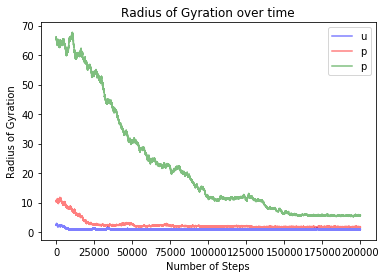
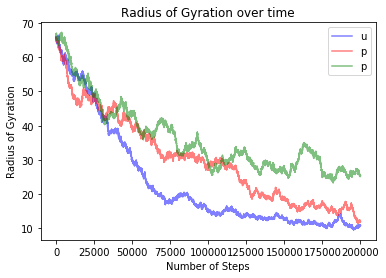

# Dynamic Models of Biology - HW1

### Colin Moore

***

### Problem 1:

### Problem 2:

• What do you feel the main contribution of this paper is? (10 points)

- I feel the main contribution of this paper is the ability to predict structures formed by DNA sequences and to be able to create those sequences to very specific conformations. Going off of that, it is also important to be able to show that more than two or four DNA molecules can interact in a predictable way to form larger structures beyond the double helix, double-crossovers, etc. that DNA can do naturally. To be able to create large 2-D surfaces out of relatively simple structures is a very important find.

• What’s the essential principle that the paper exploits? (10 points)

- The paper exploits the rigidness and base pairing of DNA double-crossover molecules that are found in meiosis. These molecules have a high amount of stability between multiple strands of DNA due to their crossing over in two regions. Beyond this structure, the paper relied most heavily on the base pairing of the DNA nucleotides. They were able to predict the assembly of these large particles due to exposed sticky ends that base paired predictably with their neighbors to form large aggregates that were composed of thousands of DNA molecules.

• Describe one major strength of the paper. (10 points)

- One strength of the paper was their ability to form the same structure with multiple different types of molecules and not only having a repeating pattern of 2 but also having a repeating pattern of 4, showing that a potentially arbitrary number of repeats can be inserting into the sequence to make a sufficiently complicated system for many needs. Beyond that, using molecules that were well understood and could be very stable on their own was another strength that allowed them to test some of the limitations of this idea.

• Describe weakness of the paper. (10 points)

- A weakness of the paper I think was the fact that they didn't really discuss the full limitations or possiblities of this idea. They only tested one structure of DNA, double-crossovers, for good reason as they are very stable but I would have liked to see if they could make a more unstable structure work to their advantage or find other possible structures to utilize. I also wish they had talked more about the sequences of the molecules that they used as they talked about the base pairing of the molecules but did not go into great detail about them. I would have liked to see them discuss the number of possible sequences from a theoretical stand point and also to discuss how to possibly go beyond that limit if need be.

• Describe one future work direction you think should be followed. (10 points)

- Already knowing a lot about "DNA origami", I think that this field is hugely interesting. The most interesting idea that I know about is the idea to use DNA macrostructures as deliverables for therapeutic medicine in the body. Creating large three dimensional structures out of DNA has been utilized to specifically target medicine to specific cells in the body. This was revolutionary because these large DNA structures protected the therapeutic agent from the bodies immune system and also were able to find the molecular target of the medicine through tags on the outside of the DNA structure so the off target effects were limited. I also wonder if these structures can be used for more cases like 3-D scaffolds that can be easily built off of for combatting specific diseases or supporting cell growth in culture or solution.

***